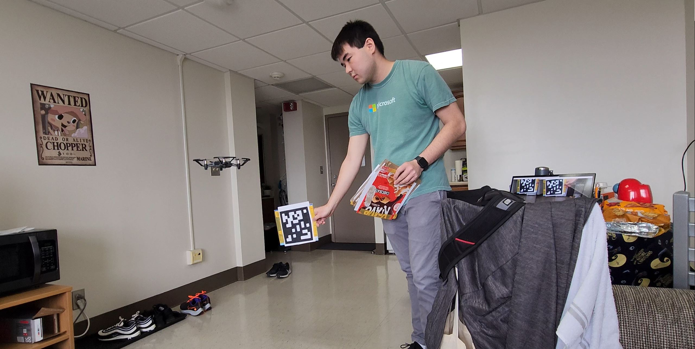

# Hopfield Drone

## Contributors
- Jovan Yoshioka ([GitHub](https://github.com/jovanyoshioka))
- Dong Jun Woun ([GitHub](https://github.com/djwoun))

## Project Description
Using Hopfield networks to implement a pattern-based computer vision system for autonomous drone flight.

Computer vision is vital to state-of-the-art, next-generation technologies, from autonomous vehicles to augmented reality. However, these technologies often use resource-intensive deep learning models to achieve this computer vision. Hopfield neural networks (HNN) are explored as a relatively cheaper, robust alternative by developing a custom pattern-based computer vision system applied to autonomous drone flight. After detecting a pattern via lightweight, accurate, and accessible OpenCV image processing, the HNN handles the pattern recognition, utilizing associative memory capabilities. The pattern detection algorithm was accurate and robust against differing backgrounds, bright and dark lighting conditions, and various pattern orientations. The pattern recognition algorithm could still recognize patterns with fifteen to twenty flipped bits, i.e., noise, out of one hundred bits. After successfully testing the computer vision system with an autonomous drone, it was ultimately concluded that HNNs are a feasible method to implement a robust, CPU-based computer vision system for real-time pattern-based applications. Improvements can be made regarding optimizing HNN parameters.

## Demo
[Demo Video File](https://github.com/jovanyoshioka/Hopfield-Drone/blob/main/demo.mp4)

You can also view the demo video at my [virtual portfolio](https://jovanyoshioka.com/pages/projects.html?section=hopfieldDrone).

## Paper (Unpublished)
[Paper](https://github.com/jovanyoshioka/Hopfield-Drone/blob/main/paper.pdf)

## Poster
[Poster](https://github.com/jovanyoshioka/Hopfield-Drone/blob/main/poster.pdf)

## Acknowledgment
This project was created for the Biologically-Inspired Computing course (COSC 420) taught at The University of Tennessee Knoxville in the Min H Kao. Department of Electrical Engineering and Computer Science. Thank you to Dr. Catherine Schuman for her instruction and support throughout the course, enabling this project.
